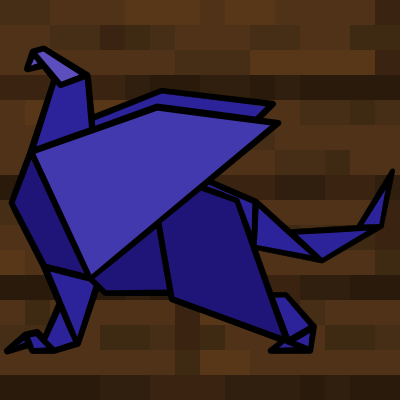

# Gryphon

[>> Downloads <<](https://github.com/CottonMC/Gryphon/releases)

*Compact modpack maker*

**This mod is open source and under a permissive license.** As such, it can be included in any modpack on any platform without prior permission. We appreciate hearing about people using our mods, but you do not need to ask to use them. See the [LICENSE file](LICENSE) for more details.

Gryphon allows you to create full modpacks within a single jar. Modpacks can include mods, resources, and data for your players to play using. Configuration support coming soon.

## Using Gryphon
To start off making a Gryphon pack, clone this repo. While you can theoretically make a Gryphon pack without an IDE, it's recommended that you use one. Import the project into your IDE of choice. If you want, replace the `src/main/resources/assets/gryphon/icon.png` file with an icon of your choice.

### Gryphon.gradle
After importing, open up the `gryphon.gradle` file. This is where you'll configure everything for your modpack. The `name`, `version`, and `description` will be visible inside the `fabric.mod.json` file for mods like Mod Menu to see. The `projectName` will be used to name the compiled and exported jar. The rest of the blocks in `gryphon.gradle` are used to actually assemble the pack.

### Adding mods to the pack
The easiest way to add a mod to a Gryphon pack is through maven, a system for hosting versions of Java programs. The [Fabric maven](https://maven.fabricmc.net), [Cotton maven](http://server.bbkr.space:8081/artifactory/libs-snapshot), and [CurseForge maven](https://authors.curseforge.com/knowledge-base/529-api) (The [CurseForge Maven Helper](https://github.com/Wyn-Price/CurseForge-Maven-Helper) is suggested) are all pre-included, so if the mod you want to add is one one of those mavens, you're in luck. If the mod is on a different maven, add the maven to the `repositories` block. Put the Maven identifiers of any mod you want to include in the `mavenMods` array.

However, not all mods are on a maven. In those cases, you'll need to import compiled jars. Due to the obfuscation of Minecraft, compiled jars come in two forms: a development-compatible jar and a production-compatible jar. The development-compatible version should *always* be named the same as the production-compatible jar, but with `-dev` added onto the end. To include a compiled jar, put both the development-compatible and production-compatible jar in the `Gryphon/libs` folder, and add the name of the production jar *without the .jar file extension* to the `fileMods` array.

### Adding assets and data
Resource and data packs are some of the most helpful tools for a modpack maker configuring mods to their liking (autoamtically setting up config files outside of data packs coming soon). Gryphon can load any resources put in the `src/main/resources/assets` folder and data in the `src/main/resources/data` folder. Treat these folders like the home folders of a data or resource pack, respectively. These will override resources from other mods and vanilla. To change the vanilla recipe for a bucket, for example, you would put a new recipe json at `src/main/resources/data/minecraft/recipes/iron_bucket.json`.

### Default config
Gryphon does not yet support shipping with default config. This will be changed as soon as possible. In the meantime, you can prepare for this by putting the configs you want in `src/main/resources/config`.

### Exporting
When you're ready to share your pack, run `gradlew build` in the Gryphon directory. Take the resulting `<pack name>-<version>.jar` and share it with your players! To run the pack, all they need to do is install Fabric Loader and drop the jar in the `mods` folder.
